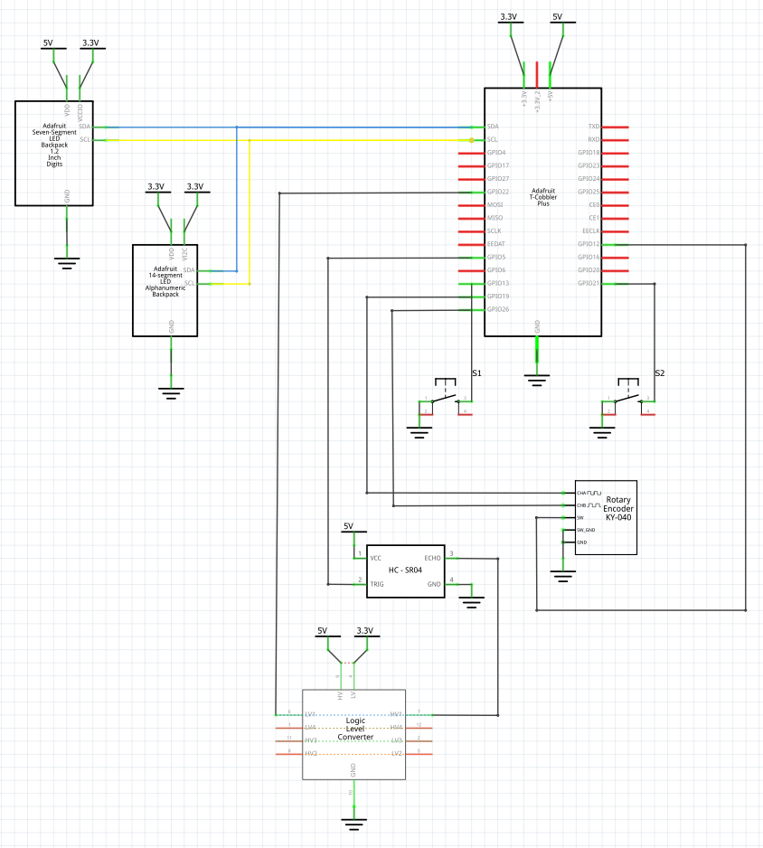

# Alarm-Clock  
Personal project. Not fully baked. UI is not great. Code is not very well written and is unclear.  
Raspberry Pi based alarm clock with 7-segment display.  
  
Schematic  

## Features  
1. Dimmable
2. Choose alarm sound
3. Alarm starts quietly and gradually gets louder
4. Wave to snooze
 

## Operation  
1. Press button 1 to set alarm.
  - Turn knob to set hour.
  - Press knob to go to minutes entry, turn knob to set minutes.
  - Press knob to go to AM / PM entry, turn knob to set AM or PM.
  - Press knob to go to alarm on/off, setting turn knob to set on or off.
  - Press button 1 to exit at any time.
2. Press button 2 for mode settings
  - Initial mode setting is display brightness. Turn the knob to change brightness.
  - Press the knob to go to set alarm sound. Turn the knob to select the sound.
  - Press the knob to change volume. Turn the knob to change the volume.
  - Press the knob to go to display on/off setting. Turn the knob to set on or off.
     - Note it's been a long time since I wrote this code. I'm not sure what this setting does. I think the display will turn on and off or dim automatically based on time, but I need to study the code to figure this one out.
  - Press button 2 to exit at any time.
  

 ## Parts List
1. 1 x Raspberry Pi Model 2 w/ SD Card
2. 1 x USB power supply for Raspberry Pi
3. 1 x Adafruit 1.2" 4-Digit 7-Segment Display w/I2C Backpack - Yellow. Product ID: 1269
4. 1 x Adafruit Quad Alphanumeric Display - Red 0.54" Digits w/ I2C Backpack - STEMMA QT / Qwiic. Product ID: 1911
4. 1 x Adafruit Rotary Encoder. Product ID: 377
5. 1 x HC-SR04 Ultrasonic Distance Sensor
6. 1 x Sparkfun Logic Level Converter - Bi-Directional. PN BOB-12009
7. 2 x Sparkfun Mini Pushbutton Switch. PN COM-00097
8. 1 x Adafruit T-Cobbler Plus. Product ID: 2028
9. 4 x 2P 0.1" Pitch PCB Mount Screw Terminal Block
10. 1 x 3P 0.1" Pitch PCB Mount Screw Terminal Block
11. 1 x BusBoard Prototype Systems Breadboard. PN BB830
12. Various jumper wires
13. iHome iM60LT Rechargeable Mini Speaker - Blue

